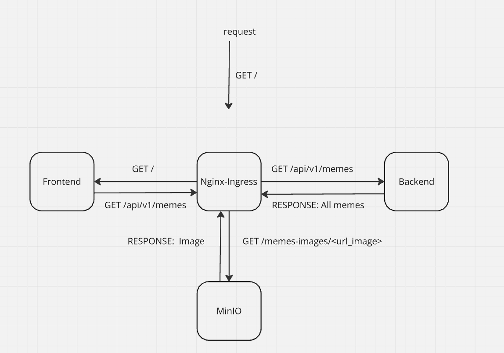
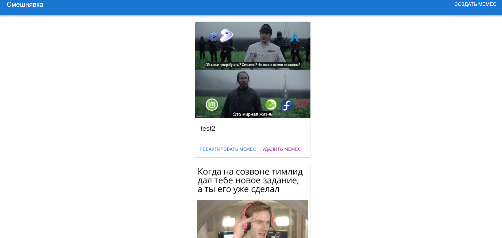
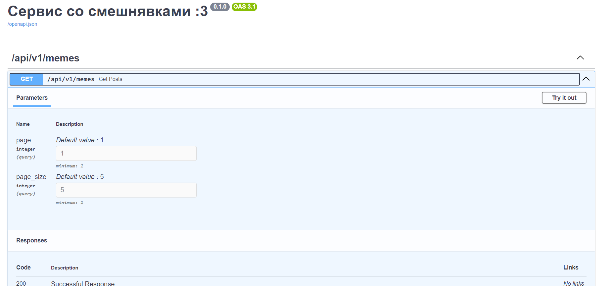

# Тестовове задание. Сервис Смешнявка

## Смешнявка - это фулл-стек приложение, который позволяет коллекционировать ваши любимые мемесы, вы можете создавать, редактировать, удалять. А восхитительный web-ui позволит вам получать удовольствие от просмотров мемесов и поднимать Ваше настроение каждый день, скорее разворачивайте это приложение и коллекционируйте мемесы уже сейчас!
___

## Схема приложения.
### Приложение состоит:
### сервис backend - он содержит основную бизнес-логику приложения и предоставляет публичный API для клиентов
### сервис frontend - предоставляет пользовательский интерфейс для взаимодействия с основным бэкендом
### сервис s3-bucket(MinIO) - публичное хранилище картинок/медийки
### Load-Balancer Nginx - прячет сервисы frontend, backend за собой, рулит нагрузкой, проксирует клиентские запросы через себя и маршутизирует их в нужные сервисы и отдает ответ клиенту

## Принцип работы:
### Пользовательский запрос идет через nginx ,nginx шлет его в контейнер с фронтом, фронт шлет через nginx запрос на backend, backend возвращает ему пост и ссылку на мемес в s3, фронт это вот все получает, берет ссылку и идет в s3 и рендерит страничку, возвращает ответ клиенту

## Стек приложения:

  &nbsp;
  &nbsp;
  &nbsp;
  &nbsp;
  &nbsp;
  &nbsp;

____
## Руководство по разворачиванию приложения
### 1) Установка зависимостей
#### Для начала создаем виртуальное окружение(я использую conda, но вы можете использовать свой любимый менеджер пакетов)
`conda create -n memes`
### Устанавливаем `poetry`
`conda install poetry`
### Подтягиваем зависимости
`poetry install`
### 2) Разворачиваем в докере
#### Можно использовать скрипт из `Makefile` или вручную прописать команду
#### Makefile:
`make build`
#### Docker-compose:
`docker-compose up -d --build`

___
### После этого web-ui будет доступен по адресу `localhost`

___
## Тесты.
### Тесты уже включены в основную CI систему, но можно запустить их и вручную
`pytest tests`
___
## Документация.
### После разворота приложения документация будет доступна по адресу `http://localhost/api/v1/docs`

___

## Developer: Dr1DeX
